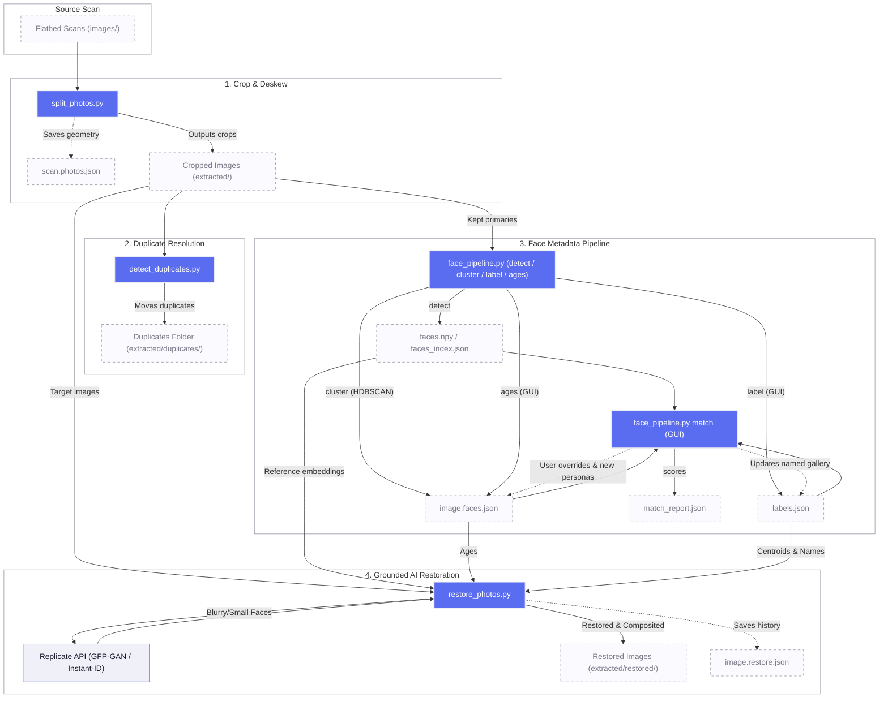

# RetroTouch

Six command-line and interactive tools for digitizing, organizing, and restoring scanned
photos:

1. **`split_photos.py`** — split a flatbed scan that contains several photos into
   individual cropped images.
2. **`face_pipeline.py`** — detect faces in those crops, group them by person, and
   tag them, using [InsightFace](https://github.com/deepinsight/insightface)
   embeddings + HDBSCAN clustering.
3. **`detect_duplicates.py`** — detect and resolve duplicate photos in the extracted crops using perceptual hashing (dhash) and union-find grouping.
4. **`restore_photos.py`** — restore old/blurry photos, reconstructing faces
   *grounded on a sharper photo of the same person at a similar age* (using the
   labels and ages produced by `face_pipeline.py`).
5. **`exif_pipeline.py`** — tag photo dates (year/month) and locations (GPS/address) with an interactive OSM map GUI, writing to EXIF/XMP.
6. **`update_english_locations.py`** — batch-translate location names in sidecars, image tags, and local caches to English using Nominatim geocoding.

Typical flow: scan a stack of photos → `split_photos.py` to get one image per
photo in `extracted/` → `detect_duplicates.py` to clean up duplicate crops → `face_pipeline.py` to find, label, and age the people in
them → `exif_pipeline.py` to tag dates and locations → `update_english_locations.py` to translate location names to English (if needed) → `restore_photos.py` to enhance the photos with identity-grounded faces.

The tools never cross-import — they communicate only through the JSON
artifacts under `extracted/` (with EXIF/location utilities importing shared IO from `exif_pipeline.py`).

## Process Workflow



<details>
<summary>Mermaid Source</summary>


</details>


## Requirements

- Python 3.9+ (the face GUI needs a working Tk — see the note below)
- Dependencies in `requirements.txt`:

```bash
python3 -m pip install -r requirements.txt
```

On first run, `face_pipeline.py detect` downloads the InsightFace `buffalo_l`
model pack (~300 MB) to `~/.insightface`.

> **macOS Tk note:** the interactive GUIs (`face_pipeline.py label`,
> `face_pipeline.py ages`, and the `match` review window) open Tkinter windows.
> Apple's system `/usr/bin/python3` ships an old Tk that fails to open a window
> on some macOS builds. If you hit `macOS 15 (1507) or later required`, run the
> tools through a venv on a Python with a modern Tk:
>
> ```bash
> python3.13 -m venv .venv
> .venv/bin/pip install -r requirements.txt
> .venv/bin/python face_pipeline.py label
> ```

## 1. Splitting scans — `split_photos.py`

Put flatbed scans (each containing one or more photos) in `images/` (subdirectories are scanned recursively), then:

```bash
python3 split_photos.py [images_dir] [--out OUT_DIR]
```

Usage and arguments can be shown via:
```bash
python3 split_photos.py --help
```

It auto-detects the photo regions, opens a Tkinter/ttk window for you to adjust the
boxes (move, resize, rotate, set orientation), and crops each photo into
the output directory (default: `extracted/`). Detection is best-effort — touching or full-bleed photos may need
manual fixing in the editor. Per-scan box geometry is saved alongside each scan
as `<scan>.photos.json` (inside the scanned directory structure) and reloaded on restart, so your manual edits are
never lost.

Controls and gotchas are documented in `CLAUDE.md`. The editor needs a human at
the GUI.

## 2. Face detection & tagging — `face_pipeline.py`

A headless, scriptable pipeline that runs on the cropped photos in `extracted/`.
Subcommands, run roughly in order:

```bash
python3 face_pipeline.py detect   # find faces + embeddings (+ age), cache them
python3 face_pipeline.py cluster  # group embeddings into person_NNN clusters
python3 face_pipeline.py label    # name the clusters (interactive GUI)
python3 face_pipeline.py ages     # enter/correct per-face ages (interactive GUI)
python3 face_pipeline.py match --gallery extracted/labels.json  # tag new faces
```

### `detect`
Runs InsightFace (`buffalo_l`: RetinaFace detector + ArcFace embeddings) over
every image in `extracted/`. Stores each face's bounding box, a 512-d
L2-normalized embedding, and an estimated **age** (`age_source: "auto"`).
Idempotent — already-processed images are skipped on re-runs.

To add age to sidecars that were detected before the age field existed (or to
refresh the auto estimate) without re-detecting everything, run:

```bash
python3 face_pipeline.py detect --backfill-age
```

This re-runs the model and merges **only** the `age` field into existing
sidecars (matching faces by bounding-box overlap). It preserves your
`cluster`/`label` assignments and never overwrites an age you set by hand.

### `cluster`
Runs HDBSCAN over the cached embeddings to group faces into `person_000`,
`person_001`, … clusters. Faces HDBSCAN can't confidently group are marked
`unassigned`. The cluster id is written back into each face's sidecar.

Re-clustering rebuilds the groups from scratch and **overwrites any cluster
assignments you made by hand** (and can desync `labels.json`). When prior manual
work exists (a `labels.json`, or sidecars with assigned clusters), `cluster`
warns and asks you to type `yes` before proceeding; it refuses to run
non-interactively (piped/CI). Pass `--yes` (`-y`) to skip the prompt in scripts.

### `label`
Opens an interactive Tkinter window, one cluster at a time:
- a **scrollable grid of all the cluster's face crops**,
- **left-click a crop** → preview the full uncropped source photo with the face
  boxed (helps identify small/blurry crops),
- **Ctrl-click a crop** → exclude a misclustered face (sets it back to
  `unassigned`),
- type a name (or click a previously-entered name to reuse it).

Names are written to `extracted/labels.json` (`{cluster_id: name}`) after every
step, so a session is crash-safe and resumable. Needs a human at the GUI.

### `ages`
Opens an interactive Tkinter window for entering/correcting per-face ages, one
person at a time:
- a **scrollable grid of that person's face crops**, each with a small **age
  field prefilled from the auto estimate** (you nudge a number, not type from
  blank),
- **click a crop** → full-photo preview for scene context (a baby vs. an adult
  is obvious in the original).

Saving writes `age` + `age_source: "manual"` into the sidecar. A manual age is
authoritative — `detect --backfill-age` will not overwrite it. Accurate ages
matter because `restore_photos.py` uses them to pick a same-age reference face.
Needs a human at the GUI.

### `match`
Builds one mean ("centroid") embedding per labeled person from the gallery, then
scores every face against them by cosine similarity. Emits a ranked candidate
report to `extracted/match_report.json` for human review; `--apply` writes the
top-1 name back into the sidecars.

After scoring, `match` opens an interactive per-photo review window: each photo
is shown with its detected faces boxed and numbered, and a matching numbered name
input per face (prefilled with the existing label, else the match suggestion).
Editing a name writes it to that face's sidecar `label`; naming a face that has
no cluster assigns it one (reusing a same-named person's cluster, or minting a
new `person_NNN`). Edits for a photo are saved when you move to the next one. Pass
`--no-review` to keep `match` headless (report only).

**Centroids strengthen as you confirm more faces.** A person's centroid is the
mean of every embedding whose face is *assigned to that person's cluster*. A
persona you've just created from a single face has a one-embedding centroid —
weak and easily fooled. Each time you confirm that name on another face (in
review, naming an `unassigned` face with an existing person's name reuses their
cluster), that face's embedding joins the mean, and the *next* `match` run scores
against the stronger centroid. So accuracy compounds over rounds of detect →
match → confirm. Note two things: only a face whose **cluster** is set feeds the
centroid (a match suggestion you never confirm, or a `label` on a still-
`unassigned` face, does not); and the mean is unweighted, so a *wrong* assignment
pulls the centroid off just as much — use the labeler's Ctrl-click exclude to
remove a bad face if a cluster drifts.

The review window always shows each face's single best-matching person. Above the
threshold it prefills the name box; below it (or when the best guess disagrees
with a name you already set) it appears as a dim, clickable `→ Name? (0.27)` hint
— click to accept it into the box. This is what lets a freshly-created persona
(whose one-face centroid scores far below threshold) still be suggested, so you
can confirm it and grow the cluster. Hints never auto-commit; only moving to the
next photo saves.

Useful flags: `--threshold` (default `0.5`), `--top` (default `3`), `--apply`
(headless only — under `--no-review`), `--no-review`.

> On a set of scanned photos of many different people — few repeats of the same
> face — `match` will mostly report `unknown` at the default threshold. That is
> the correct, conservative result, not a failure.

### `report`
```bash
python3 face_pipeline.py report --images extracted
```
Prints how many faces and how many **unique source images** feed each labeled
person's centroid, sorted by coverage. Read-only. Useful for spotting thinly-
seeded personas (1–2 images) — those match weakly, so it shows which people to
grow by confirming more faces in review.

## Adding more photos later (incremental)

Once you've clustered and started naming people, you'll often add new photos that
contain people you've already labeled. To fold them in **without disturbing your
manual labels and cluster assignments**, run:

```bash
# 1. detect — embeds faces in the new photos only
#    (already-processed photos print "cached, skipping"; nothing is re-detected)
python3 face_pipeline.py detect --images extracted

# 2. match — scores the new faces against your existing named people and opens
#    review; faces matching a known person prefill with that name
python3 face_pipeline.py match --images extracted --gallery extracted/labels.json
```

**Do NOT run `cluster` again for incremental adds.** `cluster` re-clusters every
embedding from scratch and overwrites the `person_NNN` assignments you made by
hand (including new clusters created in review), and can desync `labels.json`.
Re-cluster only when you deliberately want to redo grouping from zero.

Why this is safe:
- `detect` is idempotent — it skips any photo that already has a `.faces.json`
  sidecar for the current model, so existing photos and their labels are untouched.
- `match` never overwrites a name you set: the review UI prefills an existing
  `label` before any match suggestion (precedence: existing label → suggestion →
  cluster's name → blank). You only fill faces you haven't named yet.
- A new person you created in review is now a named cluster, so `match` builds a
  centroid for them and suggests them on the new photos.

Note: a person you've assigned only one face to has a weak (single-embedding)
centroid, so a new photo's face may still score `unknown` at the default
threshold — just type the name in review; that grows the cluster and strengthens
future matches.

## 3. Detecting and resolving duplicates — `detect_duplicates.py`

Identify and clean up duplicate images in your extracted photos:

```bash
~/.venv/bin/python detect_duplicates.py [--dir DIR] [--threshold THRESHOLD] [--dry-run]
```

### How it works
1. **Perceptual Hashing (dhash):** Computes a 64-bit dhash for every photo in the directory.
2. **Union-Find Clustering:** Groups photos whose Hamming distance is within the `--threshold` (default: `2`).
3. **Automated Resolution:** For each duplicate group, it keeps the highest quality photo (sorting by resolution desc, file size desc, filename asc) as the primary, and moves all other duplicates to a nested `duplicates/` folder.
4. **Sidecar Preservation:** Automatically renames and moves matching `.faces.json` sidecar files along with the duplicate images, ensuring no metadata or manual tagging is lost.
5. **Collision Resolution:** Safely appends incremental suffixes (e.g. `_1.jpg`) if the duplicate directory already contains a file with the same name.

## 4. Restoring old photos — `restore_photos.py`

Restores photos in `extracted/`, reconstructing degraded faces while anchoring
them to the person's real identity. Instead of inventing a face from a generic
prior, it finds a sharper photo of the *same person at a similar age* (from your
labeled, aged faces) and uses it to guide the reconstruction.

```bash
# preview the plan for one photo — picks references, no API calls, writes nothing
~/.venv/bin/python restore_photos.py face original-001_01.jpg --dry-run

# restore just the face region(s) and composite them back into the original
~/.venv/bin/python restore_photos.py face original-001_01.jpg

# enhance the whole image, then identity-ground its faces
~/.venv/bin/python restore_photos.py photo original-001_01.jpg
```

Outputs go to `extracted/restored/<name>.jpg`, each with a
`extracted/restored/<name>.restore.json` provenance sidecar.

### How it works
1. **Reference selection.** For a face whose persona is known, it scores that
   person's *other* faces by quality (bbox area · detection score · sharpness)
   and **age proximity**. It prefers a reference within `--age-window` years
   (default 5); if none qualifies it falls back to the closest age and flags
   that in the provenance; with no age info it falls back to best quality.
2. **Deterministic-first escalation.** Every face gets a safe, non-generative
   Stage-1 enhance (denoise/sharpen/upscale). Only faces that fail a
   sharpness/size gate **escalate** to Stage-2 identity-grounded reconstruction
   using the chosen reference. Faces with no persona, or no usable reference,
   stay Stage-1 only — they're never grounded against the wrong person.
3. **Provenance.** Each face records the exact reference used (image, age,
   quality), the stage, the model, and an explicit `ai_reconstructed` flag — so
   what's original vs. AI-synthesized is always traceable. This matters for
   family/genealogy photos.

### Reference ages come from `face_pipeline.py`
The age-grounding only works if faces have ages. Run `detect --backfill-age`
and/or the `ages` GUI first so your labeled people have accurate ages.

### Providers (cloud GPU)
The generative work runs on a cloud GPU (Apple Silicon has no CUDA). The default
**`replicate`** provider needs a `REPLICATE_API_TOKEN` and makes paid calls:

```bash
export REPLICATE_API_TOKEN=...
~/.venv/bin/python restore_photos.py face original-001_01.jpg --provider replicate
```

> The `ReplicateProvider` model slugs and input keys are the manual-verification
> surface — confirm/adjust them against the current Replicate model pages, since
> hosted model signatures change. The built-in **`fake`** provider (echoes its
> input, no network) backs the tests and powers `--dry-run`.

Useful flags: `--dry-run`, `--age-window N` (default 5), `--sharpness-thresh`,
`--min-area`, `--provider replicate|fake`, `--out` (default `restored`).

## 5. Tagging dates and locations — `exif_pipeline.py`

Interactive GUI to tag each extracted photo with date (year, optional month) and location (lat/lng coordinates, address details).

```bash
# launch the interactive GUI
~/.venv/bin/python exif_pipeline.py tag

# print coverage report
~/.venv/bin/python exif_pipeline.py report
```

* **Date & Location Propagation:** Manually entered date and location values automatically propagate as the default for the next untagged photo.
* **Map & Geocoding:** Integrates OpenStreetMap via `tkintermapview`. Uses Nominatim for geocoding queries in English.
* **EXIF/XMP Preservation:** Writes EXIF DateTimeOriginal, GPS coordinates, IPTC Person Keywords, and XMP MWG Regions to the `.jpg` image safely using atomic replacement.
* **Locations Cache:** Maintains `extracted/locations.json` tracking location coordinate usage to display quick-selection chips.

## 6. Translating location names to English — `update_english_locations.py`

A utility script to translate all location metadata stored in sidecars, image EXIF/XMP tags, and the location cache to English:

```bash
# preview proposed updates without making changes
~/.venv/bin/python update_english_locations.py --dry-run

# perform translation and write updates
~/.venv/bin/python update_english_locations.py
```

* **API Reverse Geocoding:** Queries Nominatim reverse geocoding with English settings for all location coordinates.
* **Rate-Limit Friendly:** Reuses the geocoding client with a 1.1s rate-limit delay and caches results locally (coalescing within 1000m).
* **EXIF/XMP Re-sync:** Rewrites EXIF/XMP metadata on matching image files where `exif_written` was `true`.

## Data layout

```
images/
  original-001.jpg
  original-001.photos.json     # split_photos box geometry (full-res coords)
extracted/
  original-001_01.jpg          # one cropped photo per detected region
  original-001_01.faces.json   # per-photo: faces, bboxes, cluster, label, age
  faces.npy                    # (N, 512) L2-normalized face embeddings
  faces_index.json             # row -> (image, face_id) + model name
  labels.json                  # {cluster_id: name}, edited via `label`
  locations.json               # cache of lat/lng -> human name mappings with use counts
  match_report.json            # ranked match candidates per face
  restored/
    original-001_01.jpg          # restored image, written by restore_photos.py
    original-001_01.restore.json # provenance: reference used, stage, ai_reconstructed
```

Each face in a `.faces.json` carries `age` plus `age_source` (`"auto"` from the
model, or `"manual"` when set in the `ages` GUI).

All geometry and bounding boxes are stored in full-resolution image coordinates;
embeddings are stored L2-normalized so cosine similarity is a plain dot product.

## Testing

```bash
~/.venv/bin/python -m pytest tests/ -q
```

Pure functions (detection geometry, cropping, clustering helpers, embedding/
cosine math, sidecar I/O, the labeler's grid/scale/exclude helpers, age
bbox-matching, and `restore_photos.py`'s reference selection / sharpness /
escalation / compositing / provenance) are test-driven. The interactive GUI
classes (`split_photos.py`'s `Editor`, `face_pipeline.py`'s `LabelerApp` /
`AgeLabelerApp` / `PhotoReviewApp`), the InsightFace model calls, and
`restore_photos.py`'s cloud provider are verified manually.

## Project docs

Design specs and implementation plans live under `docs/superpowers/`.
Conventions and gotchas for working in this repo are in `CLAUDE.md`.
